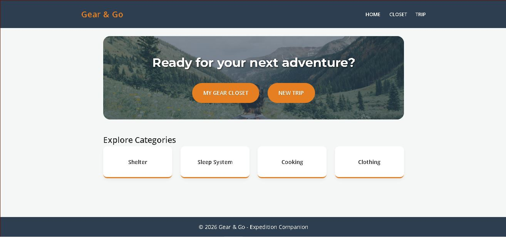

# Gear & Go - Expedition Companion 🎒⛰️

Gear & Go is a professional expedition planning web application designed for hikers and outdoor enthusiasts. It helps users manage their gear closet, track total pack weight, and get real-time weather-based gear recommendations.

## 🚀 Live Demo
[View the live project on Render](https://gear-n-go.onrender.com)

## ✨ Key Features
* **Gear Closet**: Add, manage, and categorize your outdoor equipment.
* **Weight Tracking**: Real-time visual weight indicators with safety thresholds (Light, Moderate, Heavy).
* **Smart Trip Planning**: Automatic checklist generation based on your gear closet.
* **Weather Intelligence**: Live weather data integration providing smart suggestions (e.g., rain gear alerts).
* **Offline Ready**: Service Worker integration for viewing your gear list without an internet connection.

## 📸 Visual Showcase

### Desktop Experience

### Mobile Optimization

### Core Functionality

## 🛠️ Technologies Used
* **Frontend**: HTML5, CSS3 (Modern Flexbox/Grid), JavaScript (ES6+).
* **Build Tool**: Vite.
* **Deployment**: Render (Static Site).
* **APIs**: Visual Crossing Weather API.

## 💡 Lessons Learned
- **Progressive Web Apps (PWA)**: Implemented a Service Worker to ensure gear lists remain accessible offline.
- **Accessibility (A11y)**: Integrated ARIA labels and focus-visible states to support screen readers and keyboard navigation.
- **Deployment Strategy**: Successfully configured Render with custom redirect rules for a Multi-Page Application (MPA).

## 📦 Installation & Setup
1. Clone the repository: `git clone <your-repo-url>`
2. Install dependencies: `npm install`
3. Run locally: `npm run dev`
4. Build for production: `npm run build`

